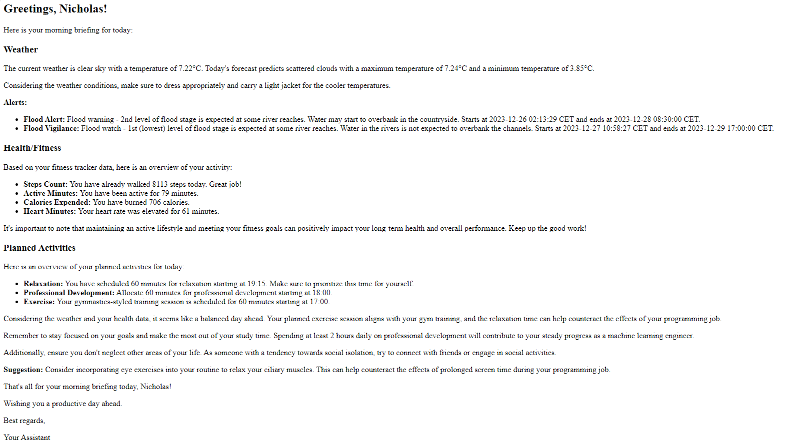

# Personal Planner
## Overview
The Personal Planner project integrates various personal data sources such as planners, fitness trackers, financial apps, and more, into a Large Language Model (LLM) to generate personalized reports. This approach aims to provide a unified view of your daily activities, health metrics, and other personal data for more informed and tailored decision-making.

## Features
- Weather Data Integration: Fetches current weather and forecasts for your location. (openweather api)
- Fitness Data Analysis: Summarizes your daily fitness activities. (google fit data accessed via nocode.com)
- Task Management: Keeps track of your planner tasks and deadlines. (usemotion.com api)
- Personalized Reports: Generates tailored daily briefings using an LLM. (openai api)
- Email outputs: The briefings are scheduled by a cronjob to be generated every day and the output is sent via email
Sample Output


# Getting Started
## Prerequisites
Access to APIs (OpenWeather, Google Fit accessed via NoCode, Motion Planner, OpenAI GPT).

## Installation

Clone the repository:

```bash
git clone https://github.com/ncapek/personal_planner.git
```
Install required dependencies:

```bash
pip install -r requirements.txt
```

Configuration
Set up your API keys and endpoints in config.py.

To run the planner:

```bash
python main.py
```

# How It Works
Data Retrieval: The application fetches data from the specified APIs.

Data Processing: Cleans and formats the data for input into the LLM.

Querying the LLM: Sends the compiled data to an LLM (like OpenAI's GPT) for generating the report.

Output: Displays a personalized daily briefing based on the processed data.

## Customization

Modify config.py to personalize API endpoints and keys.
Adjust the data extraction and processing methods for tailored outputs.